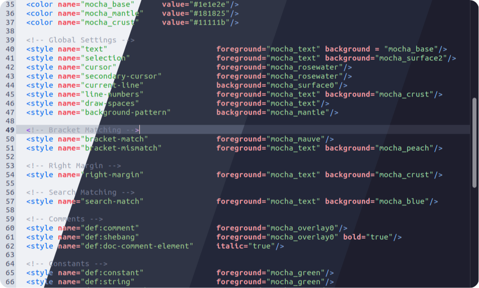

<h3 align="center">
	 
	
	Catppuccin for <a href="https://wiki.gnome.org/Apps/Gedit">Gedit</a>
	
</h3>

	
	
	

	

## Usage

1. Copy your preferred flavor(s) from [`themes/`](./themes/) to `.local/share/libgedit-gtksourceview-300/styles` (or `~/.local/share/gedit/styles` for versions earlier than Gedit 47).
2. Open Gedit's preferences menu and navigate to the **Fonts and Colors** menu.
3. Choose the flavor of your choice.
4. Enjoy!

## 💝 Thanks to

- Paolo Borelli, whose Oblivion theme I referenced when making this port.
- [sacerdOS](https://github.com/sacerd-OS)

&nbsp;

	

	Copyright &copy; 2021-present <a href="https://github.com/catppuccin" target="_blank">Catppuccin Org</a>

	

